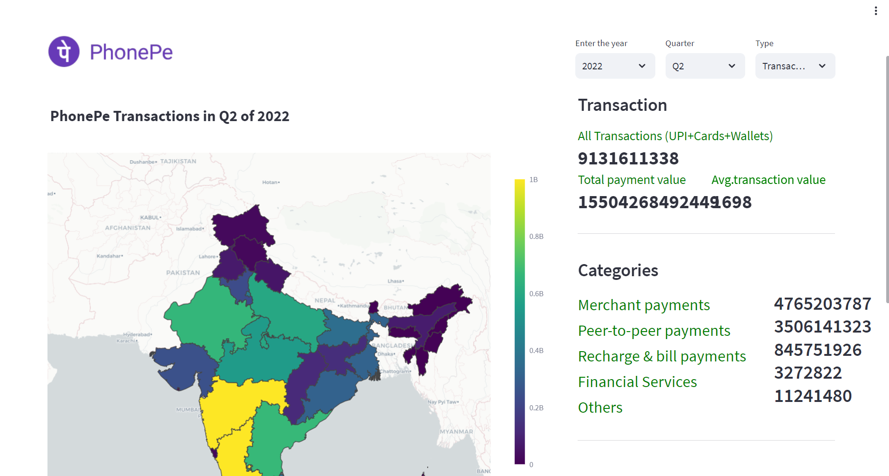
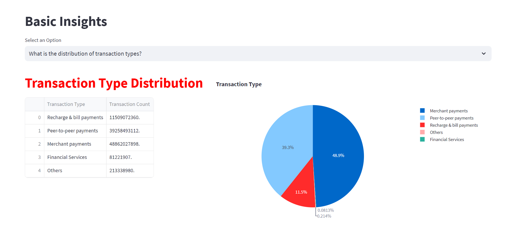

# Data Visualization and Exploration

The PhonePe Pulse Data Visualization application aims to extract, process, and visualize data from the PhonePe Pulse GitHub repository. This data contains various metrics and statistics related to PhonePe transactions, and the goal is to provide valuable insights and information through an interactive and user-friendly dashboard.

## Project Steps:

1. **Data Extraction and Repository Cloning:**
Scripting is used to extract data from the PhonePe Pulse GitHub repository.
2. **Data Transformation and Pre-processing:**
The extracted data is transformed into a suitable format.
Cleaning and pre-processing steps are performed to ensure data quality.
3. **Data Storage in MySQL Database:**
Transformed data is inserted into a MySQL database for efficient storage and retrieval.
4. **Creation of Live Geo Visualization Dashboard:**
Using Streamlit and Plotly in Python, a live geo visualization dashboard is developed.
5. **Data Retrieval from MySQL Database:**
Data is fetched from the MySQL database to populate the dashboard.
6. **Dropdown Options for User Selection:**
The dashboard includes at least 10 different dropdown options.
Users can select various facts and figures to display on the dashboard, tailoring the experience to their needs.

## Getting Started

1. Clone this repository to your local machine.
2. Install the required dependencies using the below command.
```bash
pip install streamlit
pip install pandas
pip install mysql-connector-python
pip install streamlit-option-menu
pip install pymongo
pip install os
pip install json
pip install plotly
pip install DateTime
```

3. Configure the MYSQL connection by replacing the existing password in **support/sql_queries.py** and **migrate.py** file with your MYSQL password. 

4. If you want to use the most recent PhonePe Pulse data, you can update it. First, delete the **csv_files** directories. Then, execute the following command to extract the new PhonePe Pulse data:

```bash
python extract.py
```
5. Use the below command to migrate the CSV data to MySQL
```bash
python migrate.py
```
6. Run the Streamlit app using the below command.
```bash
streamlit run main.py
```



## Contributions
Contributions to this project are welcome! If you encounter any issues or have suggestions for improvements, feel free to submit a pull request.

## Contact
For inquiries or support, please contact balajigurusamy99@gmail.com or 
[LINKEDIN](https://www.linkedin.com/in/balajiguru/)

